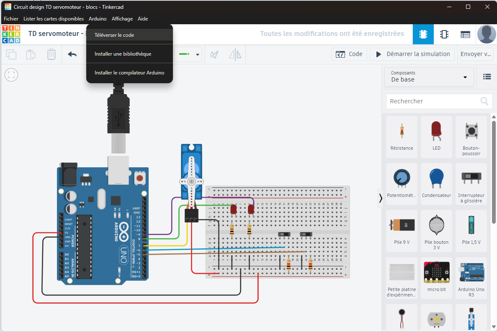

# Tinkercad QHL

Application desktop Electron qui intègre Tinkercad (Autodesk) avec des fonctionnalités Arduino pour compiler et téléverser du code directement depuis l'interface.

## 📋 Description

Tinkercad QHL (Quasi Hors Ligne) est une application qui permet d'utiliser Tinkercad dans une fenêtre desktop native, avec des fonctionnalités supplémentaires pour travailler avec Arduino. L'application intègre Arduino CLI pour compiler et téléverser vos sketches directement depuis l'éditeur de code de Tinkercad.

## ✨ Fonctionnalités

- **Interface Tinkercad intégrée** : Accès complet à Tinkercad Circuits dans une application desktop
- **Compilation et téléversement Arduino** : Compile et téléverse votre code Arduino directement depuis Tinkercad
- **Détection automatique des cartes** : Détecte automatiquement les cartes Arduino connectées
- **Copie de code** : Copie facilement le code depuis l'éditeur Tinkercad vers le presse-papier (raccourci : `Ctrl+Alt+C`)
- **Installation de bibliothèques** : Installez des bibliothèques Arduino directement depuis l'application
- **Multilingue** : Support du français et de l'anglais avec détection automatique de la langue du système
- **Installation du compilateur** : Installation automatique du compilateur Arduino AVR si nécessaire

## 📖 Utilisation

### Première utilisation

1. Lancez l'application
2. Connectez votre carte Arduino Uno à votre ordinateur
3. L'application détectera automatiquement la carte dans le menu "Lister les cartes disponibles"
4. Sélectionnez le port COM correspondant à votre carte

### Compiler et téléverser du code

1. Ouvrez Tinkercad Circuits et créez votre circuit (sinon un message d'erreur apparaîtra)
2. Écrivez ou modifiez votre programme en blocs ou code Arduino
3. Allez dans le menu **Arduino > Téléverser le code**
4. Le code sera automatiquement compilé puis téléversé sur votre carte

### Copier le code

- Utilisez le raccourci `Ctrl+Alt+C` ou allez dans **Fichier > Copier le code**
- Le code sera copié dans le presse-papier

### Installer une bibliothèque

1. Allez dans **Arduino > Installer une bibliothèque**
2. Entrez le nom de la bibliothèque (ex: `Servo`, `LiquidCrystal`, etc.)
3. La bibliothèque sera installée via Arduino CLI

### Installer le compilateur Arduino

Si c'est la première fois que vous utilisez l'application :
1. Allez dans **Arduino > Installer le compilateur Arduino**
2. Attendez la fin de l'installation

### Changer la langue

1. Allez dans **Fichier > Langue**
2. Sélectionnez **English** ou **Français**

## 🏗️ Structure du projet (maintenance)

- **`index.js`** : Processus principal Electron — IPC, fenêtre, état (ports, micro:bit), orchestration. En-tête du fichier décrit les blocs de lignes.
- **`lib/`** :
  - **`paths.js`** : Chemins app (dev/prod), Arduino CLI, micro:bit, locales.
  - **`constants.js`** : Constantes (délais, regex MakeCode, noms fichiers).
  - **`platform.js`** : Détection Windows / macOS / Linux.
  - **`logger.js`** : Logs console + fichier (si `TINKERCAD_DEBUG=1`).
  - **`notifications.js`** : Affichage des notifications dans la fenêtre.
  - **`arduino.js`** : Arduino CLI (commandes, téléchargement, compilation, téléversement).
  - **`codeExtraction.js`** : Extraction du code depuis l’éditeur Tinkercad (webview).
  - **`microbitConversion.js`** : Conversion MakeCode Python → MicroPython.
  - **`pythonUtils.js`** : Nettoyage du code Python, validation syntaxe.
  - **`menu.js`** : Construction du menu (Fichier, Arduino, micro:bit, Affichage, Aide) à partir d’un contexte.
  - **`download.js`** : Téléchargement HTTP/HTTPS avec progression optionnelle.
  - **`github.js`** : URLs des releases (Arduino CLI, HEX micro:bit).
  - **`updates.js`** : Vérification des mises à jour.
  - **`fileCache.js`** : Cache d’existence de fichiers (éviction FIFO, TTL).
  - **`utils.js`** : Utilitaires partagés (safeUnlink, safeClose).
- **`locales/`** : Traductions (fr.json, en.json). Clés utilisées par `index.js` et `menu.js`.
- **Modifier une chaîne affichée** : chercher la clé dans `locales/fr.json` ou `locales/en.json`.
- **Modifier le menu** : `lib/menu.js` (template) ; le contexte est fourni par `getMenuContext()` dans `index.js`.

## 📝 Notes importantes

- L'application nécessite une connexion Internet pour accéder à Tinkercad
- Les bibliothèques installées sont stockées dans le dossier de configuration d'Arduino CLI

## 👤 Auteur

**Sébastien Canet**

## 📄 Licence

Ce projet est sous licence **GNU General Public License v3.0** (GPL-3.0). Voir le fichier `LICENSE.txt` à la racine du dépôt.

## 🤝 Contribution

Les contributions sont les bienvenues ! N'hésitez pas à ouvrir une issue ou une pull request.

## 🔗 Liens utiles

- [Tinkercad](https://www.tinkercad.com)
- [Documentation Tinkercad Circuits](https://www.tinkercad.com/learn/circuits)
- [Arduino CLI](https://arduino.github.io/arduino-cli/)

---

# Tinkercad QHL

Electron desktop application that integrates Tinkercad (Autodesk) with Arduino features to compile and upload code directly from the interface.

## 📋 Description

Tinkercad QHL ('Quasi Hors Ligne', french Almost Offline), is an application that allows you to use Tinkercad in a native desktop window, with additional features for working with Arduino. The application integrates Arduino CLI to compile and upload your sketches directly from the Tinkercad code editor.

## ✨ Features

- **Integrated Tinkercad Interface** : Full access to Tinkercad Circuits in a desktop application
- **Arduino Compilation and Upload** : Compiles and uploads your Arduino code directly from Tinkercad
- **Automatic Board Detection** : Automatically detects connected Arduino boards
- **Code Copy** : Easily copy code from the Tinkercad editor to the clipboard (shortcut: `Ctrl+Alt+C`)
- **Library Installation** : Install Arduino libraries directly from the application
- **Multilingual** : Support for French and English with automatic system language detection
- **Compiler Installation** : Automatic installation of Arduino AVR compiler if needed

## 📖 Usage

### First Use

1. Launch the application
2. Connect your Arduino Uno board to your computer
3. The application will automatically detect the board in the "List available boards" menu
4. Select the COM port corresponding to your board

### Compile and Upload Code

1. Open Tinkercad Circuits and create your circuit (otherwise an error message will appear)
2. Write or modify your program in blocks or Arduino code
3. Go to the **Arduino > Upload Code** menu
4. The code will be automatically compiled and then uploaded to your board

### Copy Code

- Use the shortcut `Ctrl+Alt+C` or go to **File > Copy Code**
- The code will be copied to the clipboard

### Install a Library

1. Go to **Arduino > Install a Library**
2. Enter the library name (e.g., `Servo`, `LiquidCrystal`, etc.)
3. The library will be installed via Arduino CLI

### Install Arduino Compiler

If this is the first time you're using the application:
1. Go to **Arduino > Install Arduino Compiler**
2. Wait for the installation to complete

### Change Language

1. Go to **File > Language**
2. Select **English** or **Français**

## 🏗️ Project structure (maintenance)

- **`index.js`** : Electron main process — IPC, window, state (ports, micro:bit), orchestration. File header describes line blocks.
- **`lib/`** :
  - **`paths.js`** : App paths (dev/prod), Arduino CLI, micro:bit, locales.
  - **`constants.js`** : Constants (intervals, MakeCode regex, file names).
  - **`platform.js`** : Windows / macOS / Linux detection.
  - **`logger.js`** : Console and optional file logging (`TINKERCAD_DEBUG=1`).
  - **`notifications.js`** : In-window notifications.
  - **`arduino.js`** : Arduino CLI (commands, download, compile, upload).
  - **`codeExtraction.js`** : Code extraction from Tinkercad editor (webview).
  - **`microbitConversion.js`** : MakeCode Python → MicroPython conversion.
  - **`pythonUtils.js`** : Python code cleaning and syntax validation.
  - **`menu.js`** : Menu building (File, Arduino, micro:bit, View, Help) from a context object.
  - **`download.js`** : HTTP/HTTPS download with optional progress.
  - **`github.js`** : Release URLs (Arduino CLI, micro:bit HEX).
  - **`updates.js`** : Update check.
  - **`fileCache.js`** : File existence cache (FIFO eviction, TTL).
  - **`utils.js`** : Shared helpers (safeUnlink, safeClose).
- **`locales/`** : Translations (fr.json, en.json). Keys used by `index.js` and `menu.js`.
- **To change a displayed string** : look up the key in `locales/fr.json` or `locales/en.json`.
- **To change the menu** : edit `lib/menu.js` (template); context is provided by `getMenuContext()` in `index.js`.

## 📝 Important Notes

- The application requires an Internet connection to access Tinkercad
- Installed libraries are stored in the Arduino CLI configuration folder

## 👤 Author

**Sébastien Canet**

## 📄 License

This project is licensed under the **GNU General Public License v3.0** (GPL-3.0). See `LICENSE.txt` in the repository root.

## 🤝 Contributing

Contributions are welcome! Feel free to open an issue or a pull request.

## 🔗 Useful Links

- [Tinkercad](https://www.tinkercad.com)
- [Tinkercad Circuits Documentation](https://www.tinkercad.com/learn/circuits)
- [Arduino CLI](https://arduino.github.io/arduino-cli/)
